# Cloud Hosting - Learning Cloud

The goal of this project is to host a infrastructure for a full-stack e-commerce project (NestJS + React + PostgreSQL) that I built mainly as an excuse to learn how real infrastructure and hosting work. Creating a cloud server, implementing services from previous experiences with VM´s and the 42 Lisboa project **born2beroot** locking it down with a **firewall**, running **Postgres** and **Docker** on it, and getting a frontend and backend to actually talk to each other across a network.

***Disclaimer**: i wanted to do in a AWS EC2 instance since its the biggets cloud provider and the most used but i was having problems with my card so had to do with Google Cloud instead XD

This project focuses on the **cloud, networking, and infrastructure side** of the project, how the VM was set up, how the firewall and SSH were configured, how the server was protected and how the pieces were connected, rather than the application code itself wich im already developing.


## Tech Stack

**Backend:** NestJS (v11), TypeScript, PostgreSQL, Better Auth 
**Frontend:** Vite, React, TailwindCSS, TanStack Router
**Infrastructure:** Google Cloud VM (Debian), UFW firewall, Docker, PostgreSQL installed directly on the VM


# Phases of my project


| Version | Addings |
|------|---------|
| 1.0 | First commit, creating README showing SSH, UFW, Network configuration |
| 1.1 | Installation of Git, Postgresql, Docker and get the web app running (both React frontend and Nest JS API running in the container) |
| 1.2 | Basic configuration of nginx, redirecting all incomming HTTP trafic to the React frontend app |


## Architecture Overview

```
┌──────────────────────────────────────────────────────────┐
│                Google Cloud VM (Debian)                  │
│                                                          │
│   ┌──────────────┐        ┌──────────────┐               │
│   │   Frontend   │  HTTP  │   Backend    │   localhost   └────────────┐
│   │  Vite + React│ ─────► │   NestJS     │ ────────────►   PostgreSQL │
│   │  :5173       │        │   :3000      │                 :5432      │
│   └──────────────┘        └──────────────┘                            │
│                                  ▲                                    │
│                          (Docker container)                           │
│                                                                       │
└───────────────────────────────────────────────────────────────────────
        ▲                         ▲
        │ SSH :2006               │ HTTP/HTTPS :80/:443
        │                         │
   My machine                 End users
```

The VM exposes a handful of ports to the outside world, each one opened deliberately rather than left wide open, more on that below.

## 1. Creating the Cloud VM

The first step was spinning up a virtual machine on Google Cloud Compute Engine, basically renting a small Linux server that lives in Google's datacenter instead of on my own hardware, accessible from anywhere.

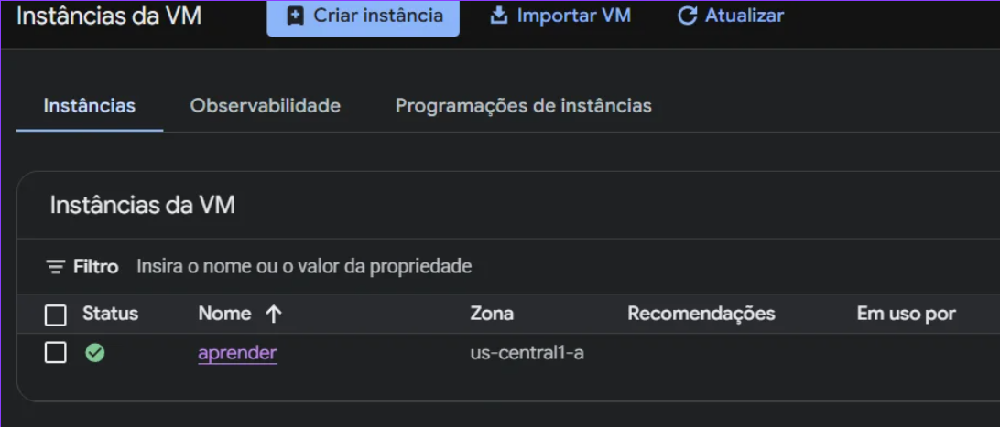

A few cloud concepts that became concrete here:

- **Instance** the actual virtual machine. Mine is named `aprender`, running in the `us-central1-a` zone (Google's data centers are grouped into *regions*, and each region has multiple *zones* for redundancy).
- **Internal vs external IP** the VM gets two addresses: an **internal IP** only reachable from within Google's private network, and an **external IP** that's routable from the public internet. Anything I want to reach from my own laptop has to go through the external IP.
- **Ephemeral vs static IP** by default the external IP can change if the VM is stopped and started again. For a "real" deployment you'd reserve a static IP so DNS records and bookmarks don't break.


## 2. Connecting via SSH

SSH (Secure Shell) is how you connect to a terminal to a machine you don't have physical access to securily. All traffic is encrypted, and authentication is normally done with a public/private key pair rather than a password.

The first connection from my machine looked like this:

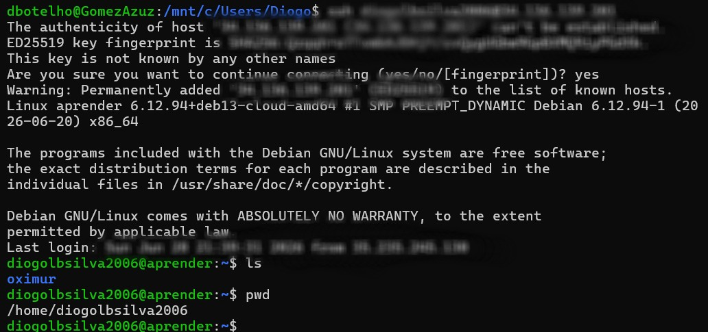

### Hardening SSH

By default, SSH listens on port 22, and `root` login is often allowed, both of which make a server vulnerable to attacks, so i changed those defaults in my server. I changed both:

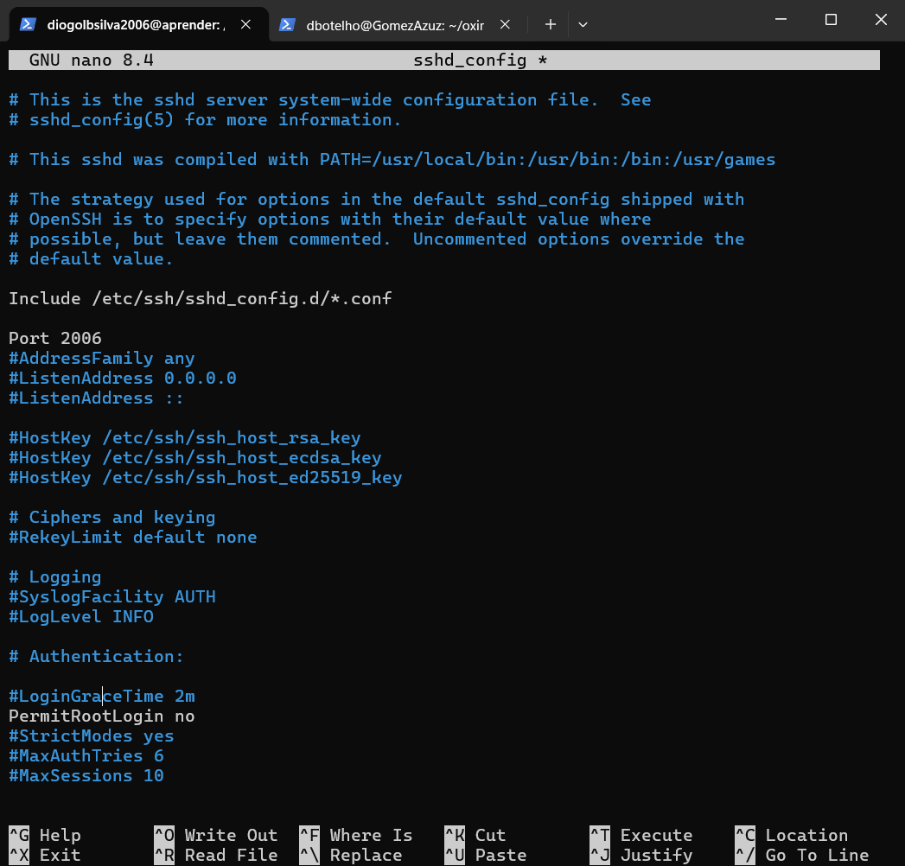

Key changes in `/etc/ssh/sshd_config`:

```
Port 2006
PermitRootLogin no
```

- **Changing the port** doesn't make SSH more *cryptographically* secure, but it does drastically cut down on noise from generic bots that only ever try port 22.
- **Disabling root login** means even if someone did guess credentials, they'd land on a low-privilege user account rather than getting full system control immediately, they'd still need to escalate privileges from there.

After editing this file, the SSH service has to be restarted for the change to take effect, and critically the **firewall** has to allow the new port, or you'll lock yourself out.


## 3. Firewall Configuration

Setting up the firewall properly across both layers the cloud provider's network and the OS itself, was probably the part where I learned the most.

### Why two firewalls?

On a cloud VM, traffic actually passes through **two separate firewalls** before it reaches an application:

1. **The cloud provider's firewall** (Google Cloud VPC firewall rules) this operates at the network level, *outside* the VM entirely. If a rule here doesn't allow a port, the traffic never even reaches the operating system.
2. **The OS-level firewall** (UFW, "Uncomplicated Firewall," a friendlier interface over Linux's `iptables`, wich i used in born2beroot 42 Lisbon project) this runs *inside* the VM and is a second checkpoint.

Both have to agree to let traffic through. This is a deliberate defense-in-depth design: misconfiguring one layer doesn't necessarily expose the server, because the other layer is still there.

### Cloud-level firewall rules

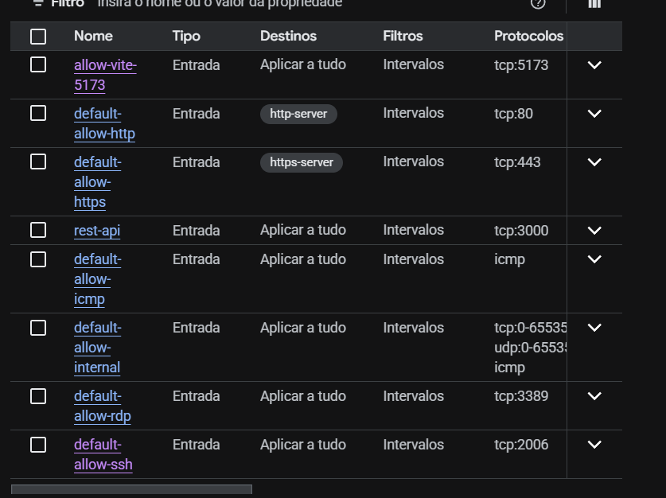

Each rule here corresponds to one allowed port:

- `default-allow-http` / `default-allow-https` → ports 80/443, standard web traffic
- `rest-api` → port 3000, the NestJS backend
- `allow-vite-5173` → port 5173, the Vite dev server
- `default-allow-ssh` → port 2006 (renamed from the default 22, matching the `sshd_config` change above)
- `default-allow-icmp` → allows ping
- `default-allow-internal` → allows all traffic *between* VMs inside the same private network this doesn't expose anything to the public internet, it's purely for internal communication between machines in the same project

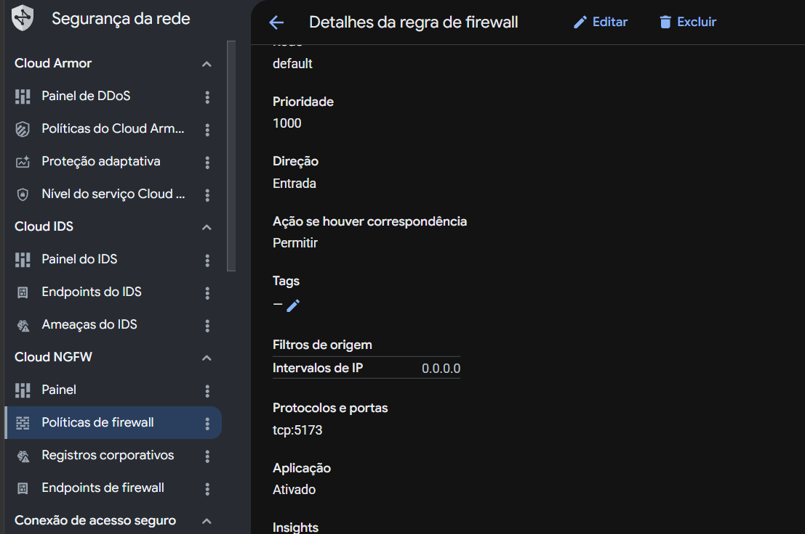

Notable fields: **direction** (ingress = incoming traffic, the type that matters for "is this port open to the world"), **action** (allow/deny), and **source IP range** (`0.0.0.0/0` means "any IP on the internet" the least restrictive option, fine for learning but not something you'd leave on a real production database port).

### OS-level firewall (UFW)

Inside the VM itself, UFW mirrors the same set of allowed ports:
```bash
sudo ufw status
```
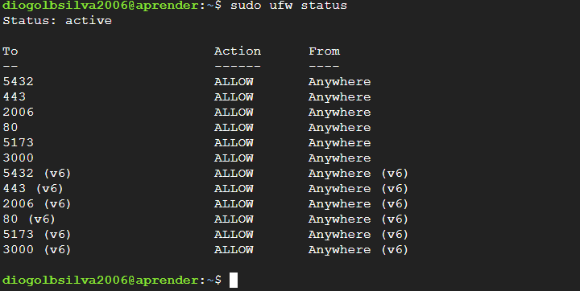

(Each also has a `(v6)` counterpart, since IPv4 and IPv6 are tracked as separate rulesets.)

**The ports, and why each one is open:**

| Port | Purpose |
|------|---------|
| 2006 | SSH (moved off the default 22) |
| 80 | HTTP |
| 443 | HTTPS |
| 3000 | NestJS REST API |
| 5173 | Vite frontend dev server |


## 4. Installing the Runtime: Node.js and Docker

With the VM reachable and locked down, the next step was installing the actual software needed to run the app.

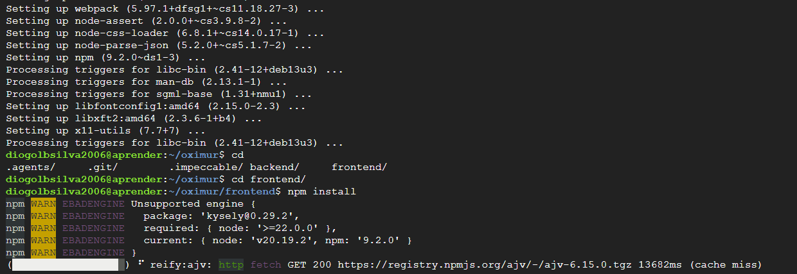

One genuinely useful thing this surfaced: npm's warnings, which show up when an installed package expects a newer Node.js version than what's actually installed. They're warnings, not hard failures but they're a good early signal to check `node -v` against what your dependencies expect before something breaks later in a more confusing way.

### Installing Docker

```bash
sudo apt install -y docker.io
```

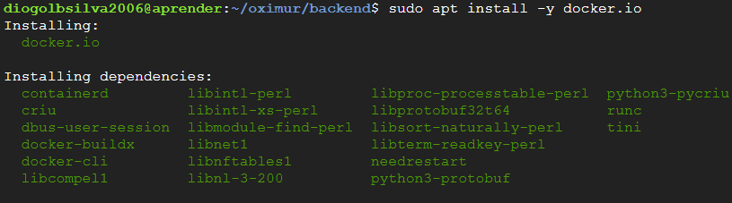

Docker lets you package an application together with everything it needs to run (runtime, libraries, OS-level dependencies) into a single portable unit called an **image**, and then run that image as an isolated process called a **container**. The appeal for deployment is consistency: the same container that runs on my laptop should behave identically on this VM, because it's not relying on whatever happens to already be installed on the host.

After installing, Docker runs as a background service (`docker.service`) managed by `systemd`, Linux's standard init system:

```bash
sudo systemctl start docker
sudo systemctl status docker
```

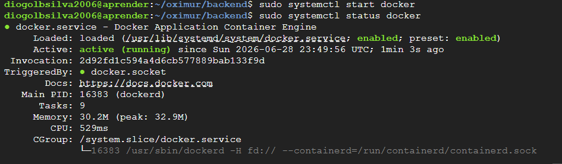

`active (running)` confirms the Docker daemon is up and listening for commands this has to be true before any `docker build` or `docker run` will work.

## 5. PostgreSQL Setup

Rather than running Postgres in a container, I installed it directly on the VM partly to practice administering a database the old way, and partly because it sidesteps a whole class of Docker networking complexity.

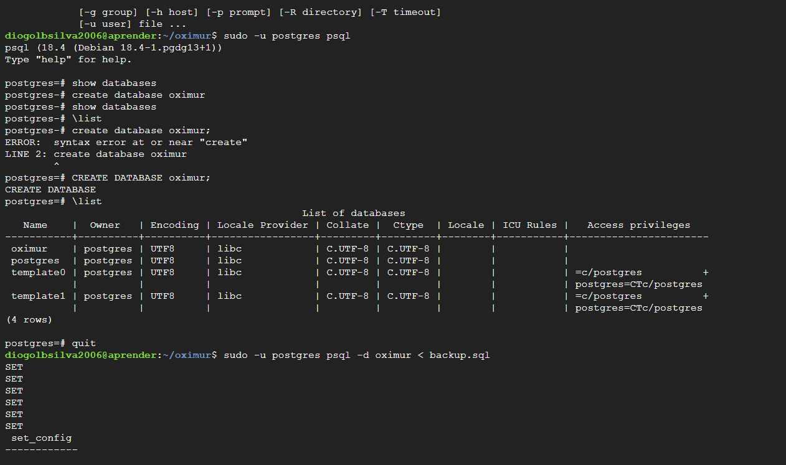

```bash
sudo -u postgres psql
```

This drops into Postgres's interactive shell as the `postgres` superuser. From there:

```sql
CREATE DATABASE db_name;
```

The database was then restored from a SQL dump:

```bash
sudo -u postgres psql -d oximur < backup.sql
```

### Letting the database accept outside connections

By default, Postgres only accepts connections from `localhost` which becomes a problem the moment your backend runs in a Docker container, because **a container has its own isolated network namespace** and `localhost` inside a container refers to the container itself, not the host machine. Without extra configuration, a containerized backend literally cannot see a database running on the host via `localhost`.

The fix lives in `pg_hba.conf` (Postgres's "host-based authentication" file, which controls *who* is allowed to connect and *how* they have to authenticate):

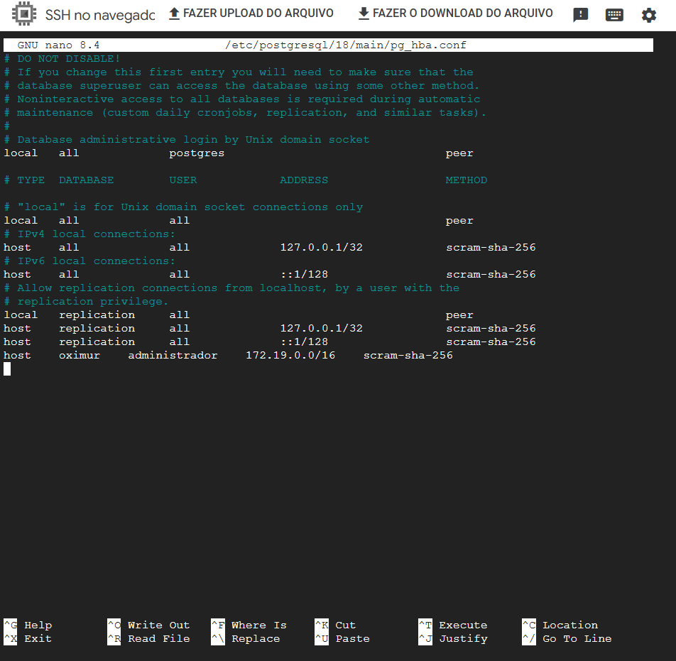

The line that matters:

```
host    oximur    administrador    172.19.0.0/16    scram-sha-256
```

That `172.19.0.0/16` range is Docker's internal bridge network, the private IP range Docker assigns to containers by default so they can talk to the host and to each other. Adding this line tells Postgres: "accept connections to the `oximur` database, from the `administrador` user, coming from any IP in Docker's network, as long as they authenticate with a password (`scram-sha-256` is the hashing algorithm used to verify it)." Without this entry, the connection gets refused outright before authentication is even attempted, regardless of whether the password is correct.

The other piece, on the Docker side, was adding `host.docker.internal` as a route, so the container has a *name* it can use to reach the host machine's network interface since `localhost` from inside the container won't work, but `host.docker.internal` resolves to the host machine specifically.


## 6. Running the Backend (Docker Compose)

Once Docker, Postgres, and the firewall were all in place, the backend could be brought up as a container:

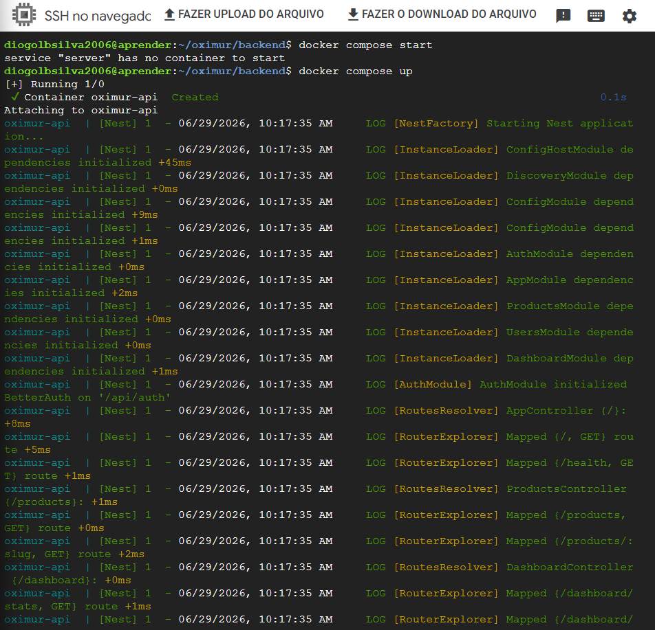

```bash
docker compose up
```

Compose reads a `compose.yaml` file describing the service (which image to build, which environment variables to inject, which ports to map, which extra hosts to register) and handles building the image and starting the container in one command, instead of typing out a long `docker run` invocation by hand every time.

The logs show NestJS's actual boot sequence modules initializing in dependency order, the auth module wiring itself up, and finally each route being registered and mapped to a controller. Seeing `Mapped {/health, GET} route` is a good sanity check that the app is alive and listening before testing it externally with `curl`.

## 7. Running the Frontend (Vite)

```bash
bun run dev
```

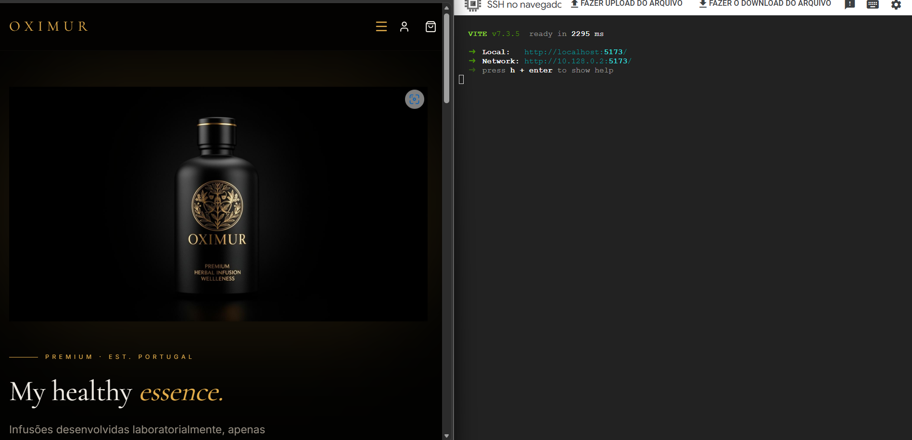

Vite's dev server prints out every address it's reachable on:

- `Local` only accessible from inside the VM itself
- `Network` accessible from other machines, **as long as the corresponding port is open in both firewalls** (which is exactly the `allow-vite-5173` rule)

By default, Vite's dev server only binds to `localhost`, refusing connections from any other address running it with `--host 0.0.0.0` (or letting it bind to all interfaces) is what makes those `Network` URLs work at all. Binding to `0.0.0.0` means "listen on every network interface this machine has," as opposed to just the loopback interface.

## 8. Nginx

After all was running ok, i decided to install nginx to improve the incoming trafic to our server, so far i just implement a redirect/port forwarding in the machine, the incoming trafic to the server gets served the frontend of the website without having to select the port, so accessing the website feels natural

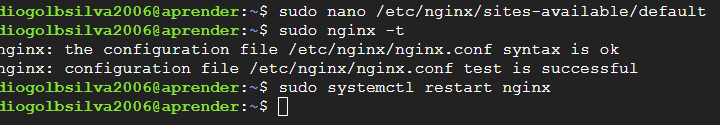

## Result

With the firewall, SSH, Postgres, Docker, nginx and both dev servers all correctly wired together, the actual application becomes reachable from a browser on any machine not just the VM itself:

### Dashboard
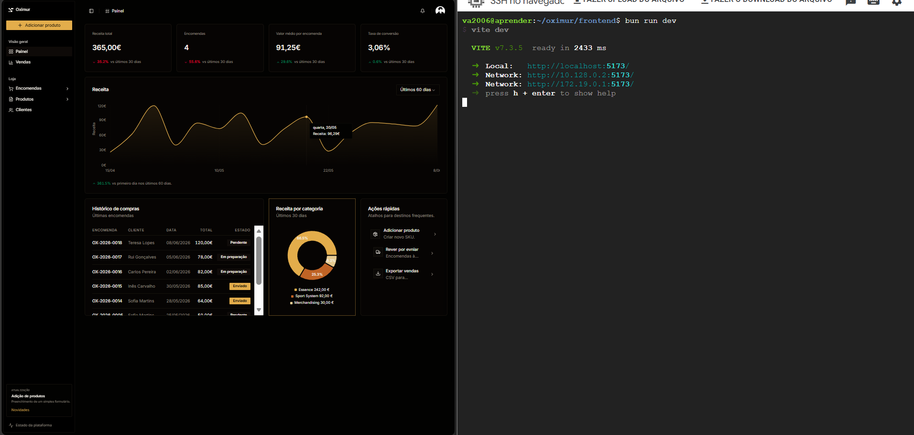

### Products
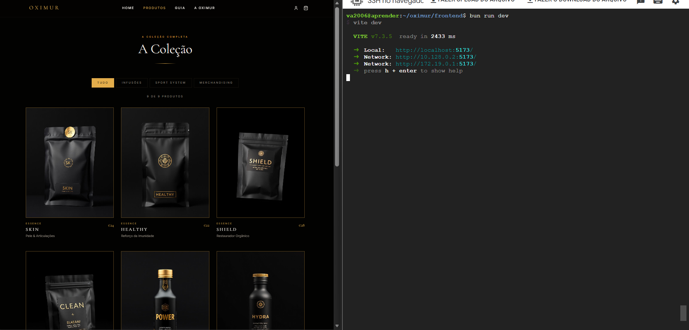

### Buying
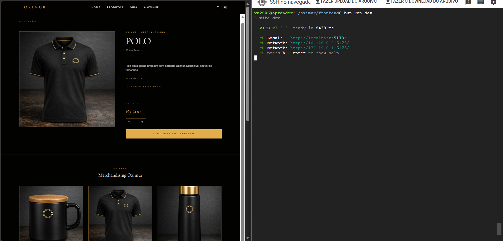

## What I Actually Learned

This project touched a lot of concepts that are easy to read about but only really click once something breaks and you have to figure out why:

- **The difference between a network-level firewall and an OS-level firewall**, and why both have to independently agree before a port is genuinely open.
- **Why containers are usefull + why they can't see "localhost" the way you'd expect** and that this single fact is the root cause of a surprising number of "it works on my machine but not in Docker" problems.
- **SSH's trust model** host key fingerprints, and why changing the default port meaningfully cuts down on automated attack noise even though it's not a substitute for real authentication security.
- **How `real infrastructures` seem to work**, its more than just npm run start and bun run dev, theres a whole process behind it
- **How a dev server's bind address (`localhost` vs `0.0.0.0`) determines who can reach it**, independent of whether the firewall allows the port.

## Status

- **Backend** functional; containerized via Docker Compose; auth integration
- **Frontend** working, built with Vite + React
- **Database** operational, running directly on the VM
- **Networking** firewall (cloud + UFW) and SSH access fully configured
- **Deployment** running live on a Google Cloud VM

## Made by sylvzzz
